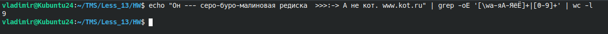

<b>Задание на регулярные выражения.</b><br>

```bash
echo "Он --- серо-буро-малиновая редиска  >>>:-> А не кот. www.kot.ru" | grep -oE '[\wа-яА-ЯёЁ]+|[0-9]+' | wc -l
```



<b>Задание 1</b><br>

Использование.
```bash
./rename {директория поиска} {1 или 2}
```
1 - добавить к лог файлам timestamp

2 - добавть python файлам hash коммита

<b>Задание 2</b><br>

```bash
./remove_duplicates.sh
```
